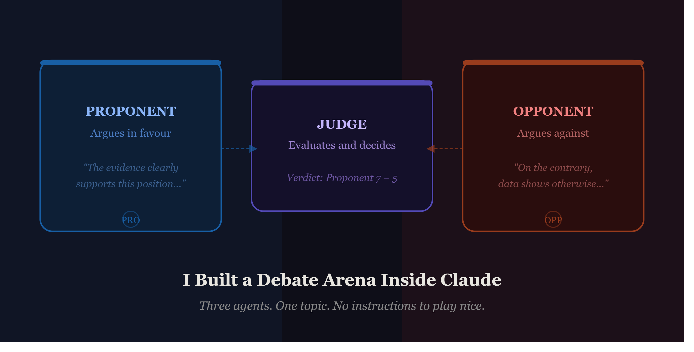

# AI Debate Arena — Multi-Agent Claude

> Three independent Claude agents argue any topic across multiple rounds. A Proponent, an Opponent, and a Judge — each with its own mandate, its own context window, and no instructions to play nice.

Built as a companion to the Medium article **"I Built a Debate Arena Inside Claude — and Let AI Argue Itself."**

---

## What it does

You enter a topic or proposition. The system spins up three separate Claude instances:

- **Proponent** — argues strongly in favour, never concedes, escalates each round
- **Opponent** — rebuts the Proponent's specific claims directly, deepens opposition each round
- **Judge** — watches the full transcript in silence, then delivers a decisive verdict with a score

Each agent only sees what the orchestrator feeds it. The Proponent reads the Opponent's last argument before responding — not the whole transcript, just the last move. The Judge receives the entire transcript only after all rounds close. This controlled information passing is what makes the rebuttals genuine rather than generic.

---

## Demo



---

## Quick start

No install. No server. No dependencies.

```bash
# 1. Clone or download
git clone https://github.com/yourusername/debate-arena.git

# 2. Open in your browser
open debate_arena.html
```

Then:

1. Paste your [Anthropic API key](https://console.anthropic.com/keys) into the key field and hit **Save key**
2. Pick a preset topic or type your own
3. Choose 1–4 rounds
4. Hit **Start debate**

Your API key stays in the browser session only — it is never stored or sent anywhere except directly to Anthropic's API.

---

## How it works

The entire system is one HTML file — ~300 lines of JavaScript, zero backend.

### The agent loop

```
User enters topic
       │
       ▼
Orchestrator (browser JS)
       │
       ├──► Proponent API call → argument
       │         │
       │         ▼
       ├──► Opponent API call (reads Proponent's last arg) → rebuttal
       │         │
       │    [repeat N rounds]
       │
       └──► Judge API call (receives full transcript) → verdict
```

### Key design decisions

**Separate histories.** Each agent maintains its own `messages` array. The Proponent never sees the Opponent's internal history — only the outputs the orchestrator explicitly passes. This is what enables adversarial behaviour.

**Controlled information passing.** In round 2+, the Proponent receives the Opponent's previous argument as its user message. The Opponent receives the Proponent's latest argument. Neither sees the full transcript mid-debate.

**Judge is stateless until the end.** The Judge receives a clean concatenation of all rounds only after the debate closes. This prevents it from being influenced by momentum — it evaluates the full body of arguments at once.

**System prompts are the product.** Each agent's system prompt contains its mandate, constraints, and behavioural rules. Getting these right is 80% of multi-agent engineering.

### The system prompts

**Proponent:**
```
You are the Proponent in a formal debate. Your sole job is to argue 
strongly and persuasively IN FAVOUR of the topic given to you.
Never concede. Escalate each round. Use evidence and reasoning.
```

**Opponent:**
```
You are the Opponent in a formal debate. Your sole job is to argue 
forcefully AGAINST the topic given to you.
Never concede. Rebut specific claims. Sharpen your critique each round.
```

**Judge:**
```
You are an impartial Judge. Evaluate reasoning quality, evidence, 
and rebuttal effectiveness. Be decisive — declare a winner with a score.
No "both sides make valid points."
```

---

## Preset topics

- AI will eliminate more jobs than it creates
- Social media does more harm than good
- Universal basic income should be implemented globally
- Nuclear energy is essential for a green future
- Remote work is better than office work
- Smartphones have made us less intelligent

Or type any proposition of your own.

---

## Requirements

- A modern browser (Chrome, Firefox, Safari, Edge)
- An [Anthropic API key](https://console.anthropic.com/keys)
- API usage is billed to your Anthropic account — a 2-round debate costs roughly 2,000–4,000 tokens per agent call

---

## File structure

```
debate-arena/
├── debate_arena.html   # The entire app — open this in your browser
└── README.md           # This file
```

---

## Extending it

Some ideas for taking this further:

- **Add a streaming mode** — use the Anthropic streaming API so arguments appear word by word
- **Add a code review system** — swap Proponent/Opponent for Security, Performance, and Readability agents reviewing pasted code
- **Parallelise agents** — run Proponent and Opponent calls with `Promise.all` to halve the wait time
- **Persist transcripts** — save debates to `localStorage` and build a history view
- **Add a moderator agent** — a fourth agent that can interject to ask clarifying questions mid-debate

---

## Related

- Medium article: [I Built a Debate Arena Inside Claude — and Let AI Argue Itself](#)
- [Anthropic API docs](https://docs.anthropic.com)
- [Claude model overview](https://docs.anthropic.com/en/docs/about-claude/models)

---

## License

MIT — do whatever you want with it.
